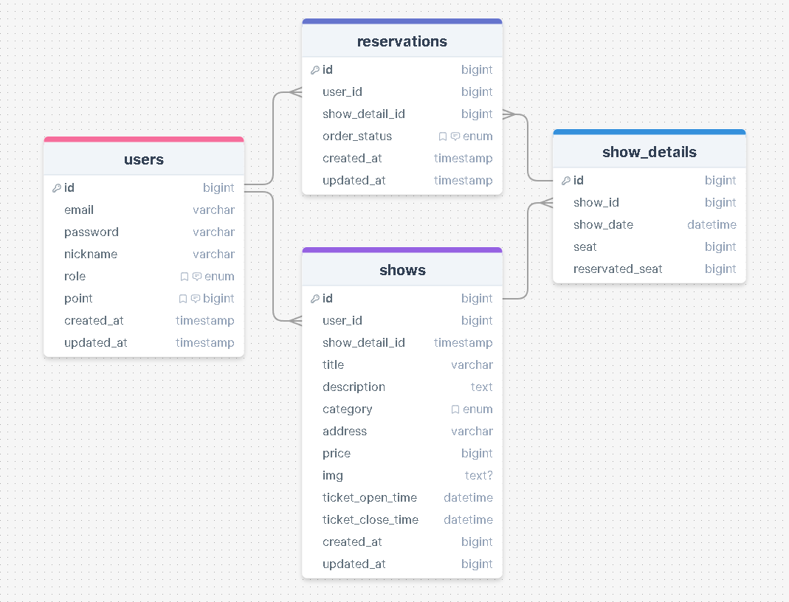

# pp5ticketing: 온라인 공연 예매 사이트

## 프로젝트 소개 어쩌구

## API

[API명세서](https://www.notion.so/p5-1725d6610a6f4ce89d61b545c5042dfa?pvs=4)

## ERD



### **`Virtual Column`** 을 사용하지 않고 `reservatied_of_seat` 계산한 이유

가상 컬럼을 선택을 안 한 이유에 대해서 설명할 수 있어야 된다.

가상 컬럼은? 차이점은?

### **`Isolation Level`** 이란?

1. **`READ UNCOMMITTED`**

   - 설명: 가장 낮은 격리 수준이다. 트랜잭션의 변경 내용이 `COMMIT`이나 `ROLLBACK` 여부에 상관 없이 다른 트랜잭션에서 값을 가져올 수 있다.

   - 장점: 읽기 작업이 매우 빠르지만, 가장 일관성이 낮다.

   - 문제점: **`Dirty Read`** 현상이 발생할 수 있다.

     **`Dirty Read`** : 트랜잭션이 작업을 완료하지 않았는 데, 다른 트랜잭션에서 볼 수 있게 되는 현상.

2. **`READ COMMITTED`**

   - 설명: RDB에서 대부분 기본적으로 사용되고 있는 격리 수준이다. 트랜잭션은 `COMMIT`된 데이터만 읽을 수 있고, 다른 트랜잭션이 커밋되기 전에 수행한 변경 사항은 볼 수 없다.

   - 장점: **`Dirty Read`** 를 방지할 수 있다.

   - 문제점: **`Non-repeatable Read`** 현상이 발생할 수 있다. 다른 트랜잭션이 중간에 데이터를 수정하거나 삭제할 수 있기 때문에 같은 쿼리를 두 번 실행했을 때 결과가 다를 수 있다.

3. **`REPEATABLE READ`**

   - 설명: 트랜잭션 동안 같은 데이터를 여러 번 읽어도 항상 동일한 결과를 반환한다. 트랜잭션이 시작된 이후 다른 트랜잭션이 데이터를 수정할 수 없다.

   - 장점: **`Non-repeatable Read`** 를 방지할 수 있다.

   - 문제점: **`Phantom Read`** 현상이 발생할 수 있다. 트랜잭션이 범위를 포함하는 쿼리를 여러 번 실행했을 때 중간에 다른 트랜잭션이 새로운 행을 삽입하면 결과가 달라질 수 있습니다.

4. **`SERIALIZABLE`**

   - 설명: 가장 높은 격리 수준. 트랜잭션을 순차적으로 실행하는 것처럼 동작하여 모든 트랜잭션이 완전히 격리됩니다. 팬텀 리드를 방지한다.

   - 장점: 가장 높은 일관성을 보장한다.

   - 문제점: 성능 저하가 심할 수 있다. 동시성 제어를 위해 락을 많이 사용하므로, 데이터베이스의 처리량이 감소할 수 있다.

5. **`SERIALIZABLE`** 를 선택한 이유

   - 데이터의 **일관성**을 최우선으로 해야하는 예매 시스템이기 때문에.

---

<p align="center">
  <a href="http://nestjs.com/" target="blank"></a>
</p>

[circleci-image]: https://img.shields.io/circleci/build/github/nestjs/nest/master?token=abc123def456
[circleci-url]: https://circleci.com/gh/nestjs/nest

  <p align="center">A progressive <a href="http://nodejs.org" target="_blank">Node.js</a> framework for building efficient and scalable server-side applications.</p>
    <p align="center">
<a href="https://www.npmjs.com/~nestjscore" target="_blank"></a>
<a href="https://www.npmjs.com/~nestjscore" target="_blank"></a>
<a href="https://www.npmjs.com/~nestjscore" target="_blank"></a>
<a href="https://circleci.com/gh/nestjs/nest" target="_blank"></a>
<a href="https://coveralls.io/github/nestjs/nest?branch=master" target="_blank"></a>
<a href="https://discord.gg/G7Qnnhy" target="_blank"></a>
<a href="https://opencollective.com/nest#backer" target="_blank"></a>
<a href="https://opencollective.com/nest#sponsor" target="_blank"></a>
  <a href="https://paypal.me/kamilmysliwiec" target="_blank"></a>
    <a href="https://opencollective.com/nest#sponsor"  target="_blank"></a>
  <a href="https://twitter.com/nestframework" target="_blank"></a>
</p>
  <!--[](https://opencollective.com/nest#backer)
  [](https://opencollective.com/nest#sponsor)-->

## Description

[Nest](https://github.com/nestjs/nest) framework TypeScript starter repository.

## Installation

```bash
$ npm install
```

## Running the app

```bash
# development
$ npm run start

# watch mode
$ npm run start:dev

# production mode
$ npm run start:prod
```

## Test

```bash
# unit tests
$ npm run test

# e2e tests
$ npm run test:e2e

# test coverage
$ npm run test:cov
```

## Support

Nest is an MIT-licensed open source project. It can grow thanks to the sponsors and support by the amazing backers. If you'd like to join them, please [read more here](https://docs.nestjs.com/support).

## Stay in touch

- Author - [Kamil Myśliwiec](https://kamilmysliwiec.com)
- Website - [https://nestjs.com](https://nestjs.com/)
- Twitter - [@nestframework](https://twitter.com/nestframework)

## License

Nest is [MIT licensed](LICENSE).
